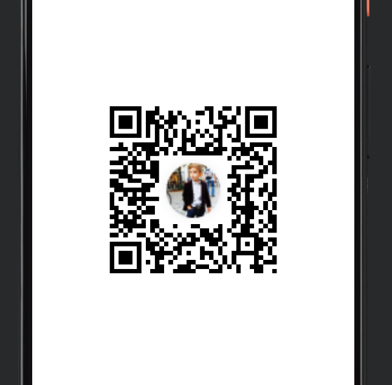

# QR Code 만들기 Sample


### 사용방법
- URL 링크를 QR 이미지로 만들어준다.
- overlay 이미지를 넣거나 기본 QR 이미지를 만들 수 있다.
```kt
val qrCodeUrl = "https://github.com/doriwori/qr-maker-sample"
val dimension = 3000

// FIXME:- overlayBitmap parameter를 지우면 기본 QR 이미지가 생성된다.
val bitmap = qrCodeUrl.convertQrCode(
   dimension = dimension,
   overlayBitmap = getBitmapFromAssetImage(
       "sample_logo.png",
       dimension/3,
   )
)

if (bitmap != null) {
   binding.ivQrCode.setImageBitmap(bitmap)
}
```

### OUTPUT

